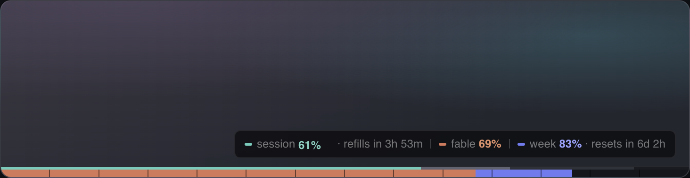

# ManaBar

An MMO-style mana bar for your agent stamina. A click-through overlay pinned to the bottom edge of every display: whatever tool you're working in, it shows how much session and weekly budget you have left, how fast the work is spending it, and exactly when you refill.

Website: [getmanabar.com](https://getmanabar.com)



## Install

[Download the DMG](https://github.com/andylimlabs/manabar/releases/latest/download/manabar.dmg) from the [releases page](https://github.com/andylimlabs/manabar/releases), open it, and drag ManaBar to Applications. Signed and notarized for macOS 12 or later, universal (Apple Silicon and Intel). Or build from source (below).

## What it shows

- The session meter (teal) that drains as you burn tokens, with ghost trails marking recent usage and a gold sweep plus a small toast when the window resets
- Weekly meters (indigo, with the per-model cap in orange) sharing a strip with 14 half-day segments
- A readout pill: `session 74% · refills in 3h 53m | fable 69%  week 83% · resets in 6d 2h`
- Gamer mode, if you prefer `74% mana left`: one toggle in the tray
- Provider switch between Claude Code and Codex, plus HUD modes, sizes, and placement options

## How it works, and why you can check

ManaBar reads the sign-in your Claude Code or Codex CLI already has on your machine and asks the provider's own API for your usage meters. Credentials never leave your machine except to that provider over TLS, nothing is stored beyond meter percentages and reset times, and there is no account, telemetry, or server involved.

That claim is auditable: the code that touches your token lives in [`src-tauri/src/lib.rs`](src-tauri/src/lib.rs), and it is short.

## Building from source

Requires Node and Rust (the standard [Tauri 2 setup](https://v2.tauri.app/start/prerequisites/)).

```bash
npm install
npm run tauri dev     # development, vite on port 1440
npm run tauri build   # release bundle
```

## Non-goals

Settled decisions, so requests for these will be closed with a link here:

- No telemetry, analytics, or accounts in the app, ever
- No cloud sync of anything, least of all credentials
- No multi-provider dashboard: the HUD renders one provider at a time
- No polling faster than 60 seconds (the usage endpoints rate-limit)

## Requests and issues

Want another bar style, meter presentation, or provider? Post it in [Discussions → Ideas](https://github.com/andylimlabs/manabar/discussions/categories/ideas) and upvote what you want built; the most-voted presentations get made. Bugs go to [issues](https://github.com/andylimlabs/manabar/issues). Providers and presentation vocabularies are deliberately easy to add: see the provider mappers and the lexicon pivot in [`src/main.ts`](src/main.ts).

## License

[MIT](LICENSE).

---

Made by Andy Lim. Not affiliated with Anthropic or OpenAI.
